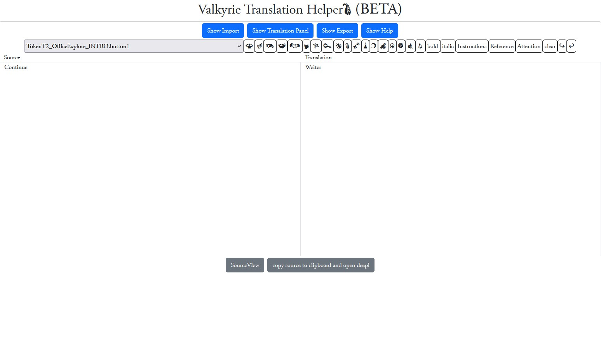

This Webpage is designed to help translate Valkyrie scenarios.
It`s currently in Alpha State, so don't rely on the functionality and backup your progress often. (nothing is more frustrating then an evening of work for the trashbin). So I repeat "SAVE OFTEN".

With this tool you can easily translate Valkyrie Localizations (or any other comma separated snippet files).

You can just upload or paste your source language localization file and start translating to your destination language.
If everything is finished, you can export the results to your new localization file.

Changed:
* Now you can mark completed snippets as "completed". You can have a better overview if a text is still completely translating or just a draft. Also you can exclude the "completed" snippets of being overwritten on an import. (e.g. if the Scenario was updated.)
* Now you can translate duplicates by pressing the butto on the bottom of the translation panel. This will search all non completed translations for already completed translations with the exact same value and translate them also. This is very hand for button texts like "continue" or "inverstigate".